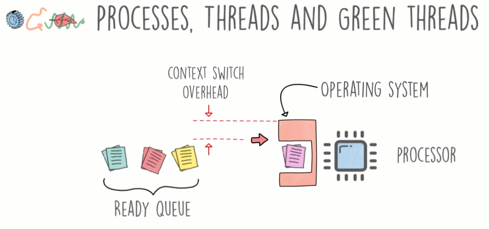
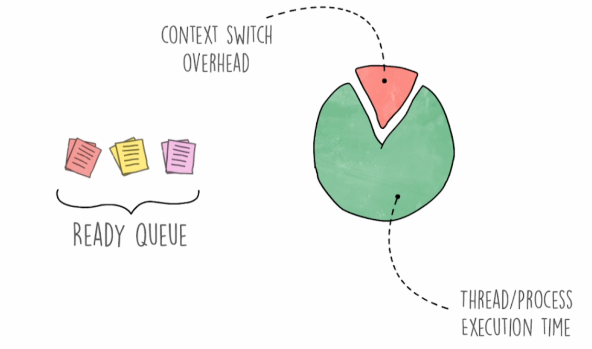
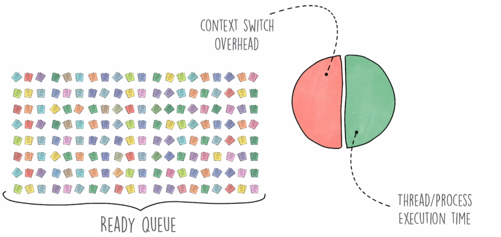
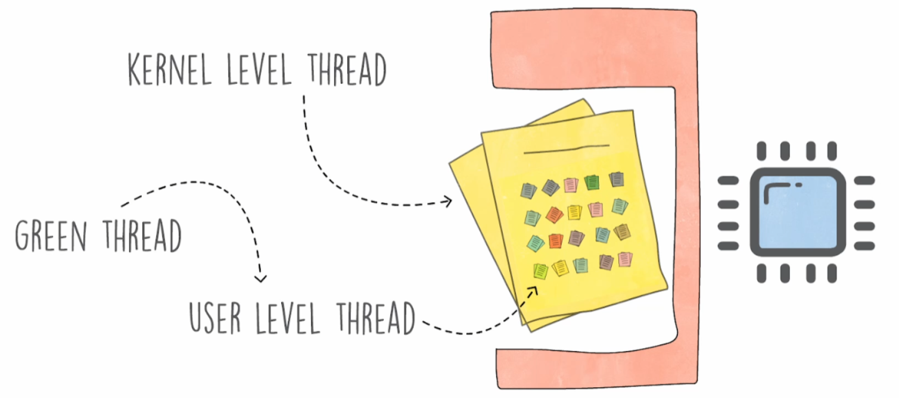

# Processes, Threads, and Green Threads

## Process

Not sharing memory
Not sharing resources

Isolation is the benefit of processes

Each process has its own memory space, if the program crashes it doesn't affect anything else.

### Problems with processes

They consume alot of resources like memory because they need their own memory space.

They also take a lot of processor time to spin up a new process because you have allocate resources.

### Examples of a process

In C or C++ you can programatically create processes using the `fork()` function.  This function basically copies the
memory space into a new space.  You can use the following to know if you are the parent of forked process.

```c++
if (fork() == 0) {
    // child process
} else {
    // parent process
}
```

You can program logic based on whether you are the parent or child process.

## Threads

An application can have multiple threads running at the same time.  Threads share memory space, and they are 
much lighter weight than a process.

## Green Threads

Green threads are lightweight threads that are trying to eliminiate the context switch overhead that occurs when the 
Operating System is switch jobs in the ready queue.



Context switching is not a big deal if you do not have lots of threads.  The three threads in the picture wouldn't be
too much of an issue because context switching isn't too expensive.

However, if we have thousands of threads, then we will have a lot of context switching.  This means that the percentage
of time switching context vs executing your code will be higher the more threads we have.

### Few Threads:


### Lots of Threads:


### Info

The academic term for gree threads is user-level thread.  Regular threads are at the kernel level.

The operating system is responsible for scheduling the threads.  A gree thread is a user level thread, so it is not the 
operating system that is scheduling the threads, but the program would schedule the thread on the CPU.



Green threads are nested inside of a kernel-level thread.  So the kernel doesn't have to get involved to do the scheduling 
of threads.

### Disadvantages

The operating sytem doesn't know about the green threads.  So if a thread is waiting for data from a disk, for example, the operating system
can move the thread back to the queue while it is waiting on the disk.

Golang creates kernel-level threads for each cpu that is available, and each of those threads has a green threads.

In Go a thread is very lightweight, and we can make as many of these to make things easier and faster.

Example of Go Threads:

_NOTE:_ Threads in Go are a hybrid of Kernel and User level threads.

Start by makeing a thread for each CPU.


User Level Threads are distributed to each of the kernel threads


When a green thread needs something from something like a disk,
Its stops the execution of the tread, and moves the green threads to kernel threads that are still running.


New Thread created while the Yellow Thread waits on the disk.
